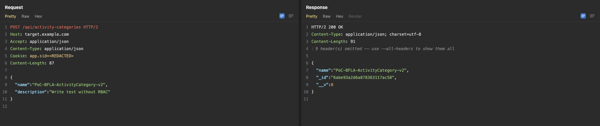

# Repeater Evidence Dumper

**English** · [Português (BR)](README.pt-BR.md) · [Español](README.es.md) · [简体中文](README.zh-CN.md) · [Русский](README.ru.md) · [Français](README.fr.md) · [Deutsch](README.de.md) · [日本語](README.ja.md)

A Burp Suite extension that turns every Repeater *Send* into a report-ready
evidence screenshot, styled like the Burp UI, with secrets already redacted.



Capturing evidence for a bug bounty or pentest report is normally a manual
chore: screenshot the Burp window, crop it, blur the cookie, repeat for every
request. This automates the whole loop. You send the request in Repeater and the
PNG shows up.

## How it works

Three pieces, wired together by a directory:

```
Burp Repeater ──(each Send)──▶ ~/burp-evidence/inbox/*.request.txt
                                                    *.response.txt
                                       │
                          watch.sh (3s polling)
                                       │
                                  shot.mjs  ──▶ HTML styled like Burp
                                       │        └▶ headless browser (--screenshot)
                                       │             └▶ crop.py (crop + notice)
                                       ▼
                               ~/burp-evidence/out/*.png
```

1. **`extension/`** is the Java extension (Montoya API). It registers an
   `HttpHandler` that writes every request/response pair originating from
   Repeater as raw text.
2. **`watch.sh`** watches `inbox/` and renders each new pair. It never
   overwrites an existing PNG, which is assumed reviewed, and records failures
   in `.failed/` so it won't retry in a loop.
3. **`shot.mjs`** builds an HTML page that replicates the Burp look (Request and
   Response panes, line numbers, JSON syntax highlighting) and photographs it
   with a headless browser. `crop.py` caps the height, adding a notice bar so a
   crop is never silent.

## Requirements

| Component | Needed for |
|---|---|
| Burp Suite (Montoya API 2025.5) | the extension |
| Java 17+ | building the extension |
| Node.js | `shot.mjs` (no external dependencies) |
| Python 3 + [Pillow](https://pypi.org/project/Pillow/) | `crop.py` (height cropping) |
| Chrome/Chromium/Edge/Vivaldi, Firefox, or Brave | rendering the screenshot |

The renderer tries those browsers in that order and uses the first one that
works. The paths are macOS ones. On another OS, adjust the `CHROMIUM`,
`FIREFOX`, and `BRAVE` constants at the top of `shot.mjs`.

## Build

```bash
cd extension
./gradlew build
```

The jar lands in `extension/build/libs/repeater-evidence-dumper.jar`. The
Montoya API is declared `compileOnly`, so Burp's own classloader provides it at
runtime and it never gets bundled into the jar.

Prefer not to build? Grab the prebuilt jar from the
[Releases](../../releases) page.

## Installation

1. **Burp** → *Extensions* → *Add* → type *Java* → pick the jar.
   The log should print `Repeater Evidence Dumper loaded`.
2. Copy the three scripts into the runtime directory:

```bash
mkdir -p ~/burp-evidence && cp shot.mjs crop.py watch.sh ~/burp-evidence/
```

3. Start the watcher:

```bash
cd ~/burp-evidence && ./watch.sh &
```

> The `~/burp-evidence/` path is hardcoded: the extension writes to
> `$HOME/burp-evidence/inbox`, and `watch.sh` expects `shot.mjs` next to it.
> To change it, edit the `INBOX` constant in the Java source and `HOME_DIR` in
> `watch.sh`.

## Usage

**Automatic.** Any *Send* in Repeater writes the pair, and the watcher renders
it into `~/burp-evidence/out/`, named after the message id, method, and path:

```
00042-post-api-activity-categories.png
```

**Manual.** Right-click inside the request/response editor of a Repeater tab and
pick **"Dump Repeater tab now (evidence)"**. Useful when the tab has not been
sent yet, in which case it captures the request only, or to force a one-off
capture. These are named `manual-00001-...`.

**Standalone.** The renderer runs on its own against any pair of files:

```bash
node shot.mjs --request req.txt --response resp.txt --out evidence.png
```

## Secret redaction

On by default. The headers below have their value replaced with `<REDACTED>`
before anything is rendered:

`Cookie` · `Set-Cookie` · `Authorization` · `Proxy-Authorization` ·
`X-CSRF-Token` · `X-XSRF-Token` · `X-Auth-Token`

Cookies keep the **name** of each pair and redact only the value
(`app.sid=<REDACTED>`), which keeps the evidence readable. You can see a session
was present without exposing the session. For `Authorization`, the scheme is
preserved (`Bearer <REDACTED>`).

`--no-redact` turns it off. Don't use it on evidence headed for a report.

## `shot.mjs` options

| Flag | Default | Effect |
|---|---|---|
| `--request <file>` | required | request file |
| `--response <file>` | none | response file |
| `--out <file.png>` | required | output PNG |
| `--width <px>` | `2000` | image width |
| `--scale <n>` | `1` | device scale factor (use `2` for retina) |
| `--max-height <px>` | `420` | max height; beyond it, crop with a notice. `0` disables |
| `--all-headers` | off | show every header, not just the essential ones |
| `--no-redact` | off | disable secret redaction |
| `--input <spec.json>` | none | read parameters from a JSON file instead of the command line |

By default the render shows only headers that matter for a report (`Host`,
`Content-Type`, `Cookie`, `Location`, `Origin`, `Referer`, among others) and
notes how many were omitted. Bodies longer than 300 lines are truncated with the
total line and byte count. In both cases the notice is visible in the image, and
the raw `.txt` in `inbox/` still holds the full content.

`--input` format:

```json
{
  "request_file": "req.txt",
  "response_file": "resp.txt",
  "out": "evidence.png",
  "width": 2000,
  "scale": 1,
  "redact": true
}
```

## Known limitation

The Montoya API 2025.5 exposes no way to enumerate open Repeater tabs or read a
tab's current state. The `burp.api.montoya.repeater` package only offers
`Repeater.sendToRepeater(...)`. Capture is therefore event driven, firing on
every real *Send*, rather than a passive read of tab state.

In practice that is equivalent or better for generating evidence, since there is
zero lag, but it means a tab that was composed and never sent is only captured
through the manual menu item.

## License

MIT. See [LICENSE](LICENSE).
